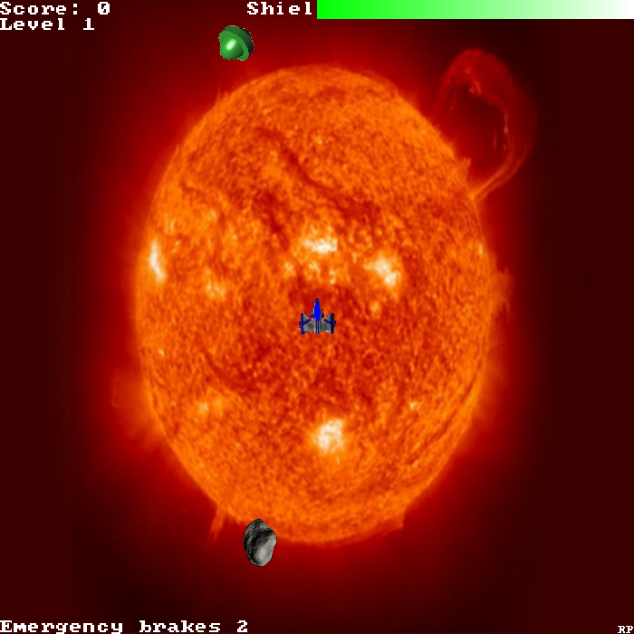

# Avenger Asteroids

> University of Hull coursework, 2003 — module *08235 Computer Graphics & User
> Interface Design*, by **Richard Potter**. Modernised from Java + GL4Java to
> **C# / .NET 8 + OpenTK** so it builds and runs today.

A twist on the arcade classic *Asteroids*. Fly a ship through a wrapping field of
spinning, splitting asteroids set against rotating NASA space backdrops, dodge an
alien that hunts and shoots at you, and survive on a depleting shield. Clear the
field to advance a level.



## Running

Requires the [.NET 8 SDK](https://dotnet.microsoft.com/download) (or newer) and an
OpenGL-capable GPU.

```bash
cd src/AvengerAsteroids
dotnet run
```

> **Play it in a browser:** the game was originally a web applet, so there's also
> a no-dependency **HTML5 Canvas** port in [`web/`](web/) — serve that folder
> statically (e.g. GitHub Pages) and play it online. See [web/README.md](web/README.md).

### Controls

| Input | Action |
| --- | --- |
| `↑` | thrust |
| `←` / `→` | turn left / right |
| `Space` | fire |
| `C` | teleport (random jump) |
| `B` | emergency stop (limited uses) |
| `F1` | toggle debug readout |

Shoot the asteroids: big ones split into four medium, medium into four small.
Watch your shield bar (green → blue → red) — collisions and alien fire deplete it.

## How it works

- **`Sprite`** is the base for everything that moves — a textured, alpha-blended
  quad with position, velocity, heading, screen-wrap and circle-radius collision.
  Each object knows how to `draw()` itself and react in `collisionEffect()`.
- **`Ship`** (you), **`Alien`** (the hunter), **`Asteroid`**/**`Asteroids`** (the
  field + splitting logic), **`Bullet`**/**`Bullets`** (both sides' shots) all
  derive from or compose with `Sprite`.
- **`Level`** advances when the field is cleared, cycling the backdrop; **`Hud`**
  draws the score/level/shield and end-game text; **`Control`** maps the keyboard.
- **`Game`** owns the world and runs one update+draw per frame; the whole thing is
  an orthographic 2-D scene of textured quads.

### Project layout

```
src/AvengerAsteroids/
  Program.cs              entry point
  AsteroidsWindow.cs      the GameWindow + render loop
  Game.cs                 world state + per-frame update/draw
  Sprite.cs               base: textured quad, movement, collision
  Ship.cs Alien.cs Asteroid.cs Asteroids.cs Bullet.cs Bullets.cs
  Level.cs Hud.cs Control.cs
  Core/                   TextureLoader, Text (bitmap font), Font8x8, Png
  Assets/                 ship / alien / meteor / flame + 3 backdrops
```

## Modernisation notes

The original was a Java applet drawing through **GL4Java**, a long-dead OpenGL
binding, and loaded textures with GL4Java's `PngTextureLoader`. The author's own
header comment notes it "works fine at uni but at home will not compile … black
boxes appear" — exactly the kind of dead-toolchain rot this port fixes. The
rendering (orthographic, immediate-mode, alpha-blended textured quads) is kept
intact; only the dead plumbing is replaced.

- **GL4Java applet → OpenTK `GameWindow`** on .NET 8; the `KeyListener` becomes
  per-frame input polling.
- **Textures via StbImageSharp** (RGBA, with the unpack alignment fixed) instead
  of `PngTextureLoader` — so the sprite alpha blends correctly and the "black
  boxes" the author hit never appear.
- **HUD text** is drawn with an embedded public-domain 8×8 bitmap font
  (`Core/Font8x8`), replacing GL4Java's `glutBitmapString` (OpenTK has no GLUT).
- **Compatibility GL context** so the legacy immediate-mode code runs unchanged,
  and the loop is capped at 60 fps for a consistent speed.
- One faithful quirk kept: the game-over screen sets the backdrop index to the
  ship texture (the original's off-by-one), so the end screen is "themed" by it.

## Credits

By **Richard Potter** (University of Hull, 2003). Space imagery, per the in-game
credit, largely courtesy of NASA.
